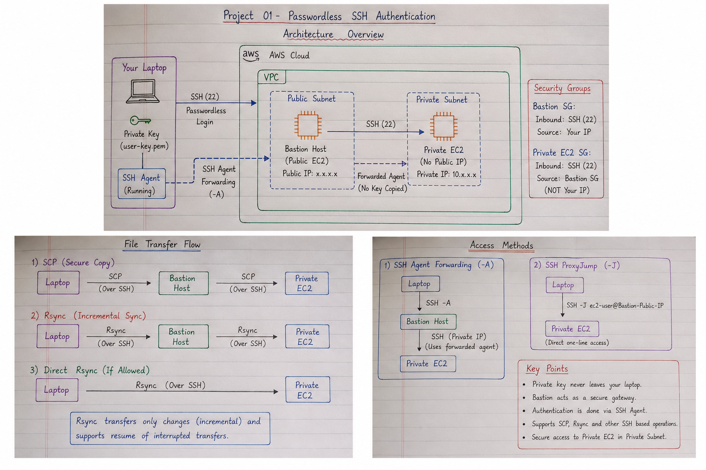

# Passwordless SSH Authentication Between Two Linux/EC2 Servers

> **AWS Internship — Center of Excellence, KIET**

---

## Table of Contents

- [Overview](#overview)
- [Objective](#objective)
- [Architecture](#architecture)
  - [Architecture Diagram](#architecture-diagram)
  - [Authentication Concept](#authentication-concept)
- [Workflow](#workflow)
- [AWS Environment](#aws-environment)
- [Key Components](#key-components)
- [Implementation](#implementation)
- [Secure File Transfer](#secure-file-transfer)
  - [SCP](#scp)
  - [Rsync](#rsync)
  - [SCP vs Rsync](#scp-vs-rsync)
- [Multi-Hop SSH Access](#multi-hop-ssh-access)
  - [SSH Agent Forwarding](#ssh-agent-forwarding)
  - [SSH ProxyJump](#ssh-proxyjump)
- [Documentation](#documentation)
- [Applications](#applications)
- [Security](#security)
- [Result](#result)
- [Project Information](#project-information)
- [Author](#author)

---

## Overview

This project demonstrates the configuration of **passwordless SSH authentication between two Linux/EC2 servers using SSH public-key authentication**.

The setup allows **Server A (source)** to securely connect to **Server B (destination)** without requiring a password for every SSH connection. Instead of password-based authentication, the connection is established using an SSH public/private key pair.

The project also demonstrates practical SSH-based operations such as:

- SSH Public Key Authentication
- Passwordless SSH Login
- Secure file transfer using SCP
- Incremental file synchronization using Rsync
- SSH Agent Forwarding
- SSH ProxyJump
- Secure multi-hop access through a Bastion Host

These concepts are important in Linux and cloud environments because they enable secure, efficient, and automation-friendly server-to-server communication.

---

## Objective

The objective of this project is to understand and implement:

- SSH public-key authentication
- SSH key-pair generation
- Public-key configuration on a remote server
- Passwordless server-to-server SSH communication
- SSH authentication verification and troubleshooting
- Secure file transfer using SCP
- Incremental file synchronization using Rsync
- SSH Agent Forwarding for multi-hop authentication
- SSH ProxyJump for accessing private servers through a Bastion Host
- The role of SSH authentication in automation and cloud environments

---

## Architecture

The basic lab consists of two Linux/EC2 servers:

| Server | Role | Private IP |
|---|---|---|
| **Server A** | Source / Initiator | `172.31.31.174` |
| **Server B** | Destination / Receiver | `172.31.22.11` |

> **Note:** The IP addresses shown above are specific to the lab environment. They may differ for other EC2 instances.

### Architecture Diagram



### Authentication Concept

The authentication mechanism uses two keys:

- **Private Key (`id_rsa`)** — remains on Server A and is never shared.
- **Public Key (`id_rsa.pub`)** — copied to Server B and stored in `~/.ssh/authorized_keys`.

When Server A connects to Server B, Server B verifies the identity of Server A using the corresponding public key.

Once authentication succeeds, the SSH session is established without requiring a password.

### Public-Key Authentication Flow

```text
              SSH Public-Key Authentication

        Server A                              Server B
        Source                               Destination
           │                                      │
           │  SSH Connection Request              │
           ├─────────────────────────────────────>│
           │                                      │
           │       Cryptographic Authentication   │
           │<─────────────────────────────────────┤
           │                                      │
           │       Public Key Verification        │
           ├─────────────────────────────────────>│
           │                                      │
           │       Authentication Successful      │
           │<─────────────────────────────────────┤
           │                                      │
           └────────── SSH Session Established ───┘

                    No Password Required
```

---

## Workflow

The complete workflow of the project is:

```text
Generate SSH Key Pair on Server A
              │
              ▼
       id_rsa + id_rsa.pub
              │
              ▼
Copy Public Key to Server B
              │
              ▼
Add Public Key to:
~/.ssh/authorized_keys
              │
              ▼
Set Correct SSH Permissions
              │
              ▼
        SSH from Server A
              │
              ▼
      Public-Key Verification
              │
              ▼
      Authentication Successful
              │
              ▼
       Passwordless SSH
```

### Server-to-Server Communication

```text
┌─────────────────────┐             ┌─────────────────────┐
│      Server A       │             │      Server B       │
│       Source        │             │    Destination      │
│                     │             │                     │
│    Private Key      │             │     Public Key      │
│      id_rsa         │             │   authorized_keys   │
└──────────┬──────────┘             └──────────▲──────────┘
           │                                   │
           │         SSH over Port 22          │
           └───────────────────────────────────┘
                         │
                         ▼
                  Passwordless Login
```

---

## AWS Environment

The implementation is performed using **Linux-based Amazon EC2 instances**.

For communication between the servers, **SSH traffic on port 22** must be permitted through the relevant EC2 Security Group configuration.

### AWS Network Requirements

| Requirement | Purpose |
|---|---|
| EC2 Instance A | Source Linux server |
| EC2 Instance B | Destination Linux server |
| Security Group | Controls inbound and outbound network traffic |
| SSH Port `22` | Secure remote administration |
| Private IP | Internal EC2-to-EC2 communication |
| Linux / OpenSSH | SSH authentication and remote access |

For server-to-server communication, the destination server should allow SSH traffic from the appropriate source.

In AWS, a Security Group rule can be configured to allow SSH from the source server's Security Group.

---

## Key Components

| Component | Purpose |
|---|---|
| `id_rsa` | Private key stored securely on Server A |
| `id_rsa.pub` | Public key generated on Server A |
| `authorized_keys` | Stores authorized public keys on Server B |
| SSH | Provides secure remote communication |
| OpenSSH | SSH implementation used on Linux |
| EC2 Security Group | Controls network access to SSH port 22 |
| SCP | Secure one-time file transfer over SSH |
| Rsync | Efficient incremental file synchronization |
| SSH Agent | Holds private keys for authentication |
| SSH Agent Forwarding | Enables authentication through an intermediate server |
| SSH ProxyJump | Enables multi-hop SSH access through a Bastion Host |

---

## Implementation

The implementation involves the following steps:

1. Generate an SSH key pair on Server A.
2. Verify the generated keys.
3. Copy Server A's public key.
4. Add the public key to Server B's `authorized_keys`.
5. Configure the required SSH file permissions.
6. Connect from Server A to Server B without entering a password.
7. Use verbose SSH output to verify authentication when required.
8. Test secure file transfer using SCP.
9. Test incremental synchronization using Rsync.
10. Understand multi-hop SSH access using SSH Agent Forwarding.
11. Access private EC2 instances through a Bastion Host using SSH ProxyJump.

For the complete list of commands used during the implementation, see:

**[Commands.md](./Commands.md)**

---

# Secure File Transfer

Passwordless SSH authentication can also be used for secure file and directory transfers between Linux servers.

## SCP

**SCP (Secure Copy Protocol)** is used to securely copy files and directories between systems over SSH.

Basic workflow:

```text
Server A
   │
   │ SCP over SSH
   │ Port 22
   ▼
Server B
```

SCP can be used for:

- Single file transfers
- Directory transfers
- Application files
- Configuration files
- Logs
- Certificates
- Database dumps

### Single File Transfer

```bash
scp file.txt user@server-b:/home/user/
```

### Directory Transfer

```bash
scp -r my-directory/ user@server-b:/home/user/
```

SCP is particularly useful when a straightforward file or directory copy is required.

---

## Rsync

**Rsync (Remote Sync)** is a Linux utility used for efficient file and directory synchronization.

Unlike a simple full copy, Rsync can transfer only the differences between the source and destination.

```text
Source
   │
   │ Rsync over SSH
   │
   ▼
Destination

Only changed data is synchronized
```

### Common Rsync Options

| Option | Purpose |
|---|---|
| `-a` | Archive mode; preserves attributes and copies recursively |
| `-v` | Verbose output |
| `-z` | Compress data during transfer |
| `-P` | Shows progress and supports partial/resumable transfers |
| `-e ssh` | Uses SSH as the transport |

### Rsync Example

```bash
rsync -avz -e ssh source/ user@server-b:/destination/
```

Rsync is useful for:

- Repeated file synchronization
- Backups
- Server deployments
- Large file transfers
- Directory synchronization
- Incremental data transfer

### Why Rsync?

Rsync is especially useful when the same data needs to be synchronized repeatedly because it can compare the source and destination and transfer only the required changes.

---

## SCP vs Rsync

| Feature | SCP | Rsync |
|---|---|---|
| Basic file transfer | Yes | Yes |
| Directory transfer | Yes | Yes |
| Incremental transfer | No | Yes |
| Transfers only changes | No | Yes |
| Resume interrupted transfer | Limited | Yes, with appropriate options |
| Metadata preservation | With options | Archive mode |
| Best suited for | Simple copies | Repeated synchronization |

### Summary

```text
SCP
 │
 └── Simple and direct file transfer

Rsync
 │
 ├── Incremental synchronization
 ├── Efficient repeated transfers
 ├── Metadata preservation
 └── Resumable transfers
```

---

# Multi-Hop SSH Access

When a private EC2 instance does not have a public IP address, it can be accessed through a **Bastion Host**.

The architecture becomes:

```text
Laptop
   │
   │ SSH
   ▼
Bastion Host
(Public EC2)
   │
   │ SSH
   ▼
Private EC2
(No Public IP)
```

The Bastion Host acts as a secure gateway between the user's machine and the private EC2 instance.

---

## SSH Agent Forwarding

**SSH Agent Forwarding** allows authentication to be performed using the SSH key stored on the user's local machine without copying the private key to the Bastion Host.

```text
Laptop
   │
   │ SSH Agent Forwarding (-A)
   ▼
Bastion Host
   │
   │ SSH Authentication Request
   ▼
Private EC2
```

The important security principle is:

> **The private key never leaves the user's machine.**

The SSH agent on the user's machine handles the authentication request.

### Example

```bash
ssh -A -i user-key.pem ec2-user@BASTION_PUBLIC_IP
```

After connecting to the Bastion Host, the forwarded SSH agent can be used to authenticate to the private EC2 instance.

### Security Consideration

SSH Agent Forwarding should only be used through **trusted Bastion Hosts** because a compromised host may potentially misuse the forwarded agent during the active session.

---

## SSH ProxyJump

**SSH ProxyJump** provides a convenient way to connect to a private EC2 instance through a Bastion Host.

Example:

```bash
ssh -J ec2-user@BASTION_PUBLIC_IP ec2-user@PRIVATE_IP
```

Conceptually:

```text
Laptop
   │
   │ SSH ProxyJump (-J)
   ▼
Bastion Host
   │
   │ SSH
   ▼
Private EC2
```

ProxyJump allows the SSH connection to be proxied through the Bastion Host without requiring a separate interactive SSH session on the Bastion.

### ProxyJump with SCP

SCP can also use ProxyJump for transferring files to a private server:

```bash
scp -J ec2-user@BASTION_PUBLIC_IP file.txt \
ec2-user@PRIVATE_IP:/home/ec2-user/
```

### ProxyJump with Rsync

Rsync can use SSH ProxyJump as its transport:

```bash
rsync -avz -e "ssh -J ec2-user@BASTION_PUBLIC_IP" \
source/ ec2-user@PRIVATE_IP:/destination/
```

---

## Documentation

### Theory

**[Theory.pdf](./Theory.pdf)**

The theory documentation covers the concepts behind SSH authentication, secure server communication, and related Linux/AWS workflows.

### Commands

**[Commands.md](./Commands.md)**

Contains the commands used to implement and verify the lab.

### Supporting Topics

The project documentation covers:

- SSH Public-Key Authentication
- Passwordless SSH
- SCP — Secure Copy Protocol
- Rsync — Remote Sync
- SSH Agent Forwarding
- SSH ProxyJump
- Bastion Host access
- Linux file and directory transfer
- SSH security and permissions

---

## Applications

Passwordless SSH authentication is useful for automated server-to-server workflows such as:

- **Automated backups** using `rsync`
- **CI/CD deployments**
- **Configuration management** using tools such as Ansible, Chef, and Puppet
- **Unattended file transfers** using `scp`, `sftp`, or `rsync`
- **Log and configuration synchronization**
- **Remote server administration**
- **Scheduled server-to-server operations**
- **Cloud infrastructure automation**

---

## Security

Security is a major part of passwordless SSH authentication.

### Private Key Protection

The **private key must remain confidential**.

```text
Private Key
     │
     ▼
Server A / SSH Agent
     │
     X
     │
     └────── Never share or copy the private key
```

Only the public key should be placed on the destination server.

### Important Security Practices

- Never share the private key.
- Never commit private keys such as `.pem` or `id_rsa` to GitHub.
- Use appropriate permissions for the `.ssh` directory.
- Protect the `authorized_keys` file.
- Restrict Security Group access to trusted sources.
- Avoid exposing SSH port `22` to `0.0.0.0/0` unless specifically required.
- Prefer Security Group-to-Security Group rules for EC2-to-EC2 communication when applicable.
- Use SSH Agent Forwarding only through trusted Bastion Hosts.
- Avoid copying private keys onto Bastion Hosts.

### Recommended SSH Permissions

```text
~/.ssh/                 → 700
~/.ssh/authorized_keys  → 600
Private Key             → 600
```

---

## Result

Passwordless SSH authentication was configured between the two Linux/EC2 servers.

The final setup enables:

```text
┌─────────────────────┐
│      Server A       │
│       Source        │
└──────────┬──────────┘
           │
           │ SSH using public-key authentication
           ▼
┌─────────────────────┐
│      Server B       │
│    Destination      │
└──────────┬──────────┘
           │
           ▼
 Authentication Successful
           │
           ▼
    No Password Required
```

The project demonstrates how SSH public-key authentication provides a secure and automation-friendly method for Linux and AWS server-to-server communication.

The concepts learned can be extended to:

```text
Passwordless SSH
      │
      ├── SCP
      │
      ├── Rsync
      │
      ├── SSH Agent Forwarding
      │
      ├── SSH ProxyJump
      │
      └── Automated Cloud Operations
```

---

## Project Information

| Field | Details |
|---|---|
| **Project** | Passwordless SSH Authentication Between Two Linux/EC2 Servers |
| **Platform** | AWS EC2 |
| **Technology** | Linux, OpenSSH, SSH |
| **Authentication** | SSH Public-Key Authentication |
| **File Transfer** | SCP, Rsync |
| **Advanced SSH** | SSH Agent Forwarding, ProxyJump |
| **Network** | EC2 Private IP / Security Groups |
| **Internship** | AWS Internship — Center of Excellence, KIET |

---

## Author

**Aditi Narang**
