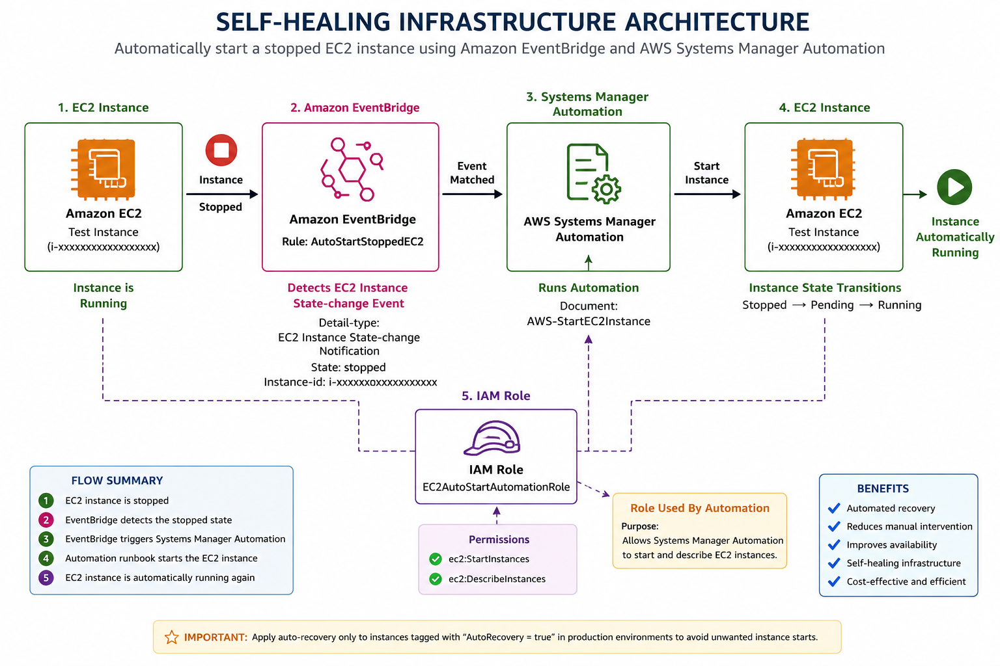

# Self-Healing Infrastructure with Amazon EventBridge and Systems Manager

> **AWS Internship — Center of Excellence, KIET**

---

## Table of Contents

- [Overview](#overview)
- [Objective](#objective)
- [Architecture](#architecture)
- [Workflow](#workflow)
- [AWS Services Used](#aws-services-used)
- [Implementation Summary](#implementation-summary)
- [Testing and Verification](#testing-and-verification)
- [Expected Result](#expected-result)
- [Security Considerations](#security-considerations)
- [Documentation](#documentation)
- [Project Information](#project-information)
- [Author](#author)

---

## Overview

This project demonstrates a basic **self-healing infrastructure** workflow using **Amazon EC2, Amazon EventBridge, AWS Systems Manager Automation, and IAM**.

The objective is to automatically recover a test EC2 instance when it enters the **stopped** state.

Instead of requiring manual intervention, Amazon EventBridge detects the EC2 state-change event and triggers the AWS Systems Manager Automation runbook `AWS-StartEC2Instance`, which starts the instance again.

---

### High-Level Workflow

```text
EC2 Instance
     │
     │ Instance enters "stopped" state
     ▼
Amazon EventBridge
     │
     │ Event pattern matches
     ▼
Systems Manager Automation
     │
     │ AWS-StartEC2Instance
     ▼
EC2 Instance
     │
     │ Automatically starts
     ▼
Running
````

This demonstrates the core principle of **self-healing infrastructure**:

> **Detect an issue → Automatically perform corrective action → Recover the system**

---

## Objective

The main objectives of this project are to:

* Understand the concept of self-healing infrastructure.
* Detect EC2 state changes using Amazon EventBridge.
* Create an EventBridge rule for a stopped EC2 instance.
* Trigger Systems Manager Automation automatically.
* Use the `AWS-StartEC2Instance` runbook.
* Configure the required IAM permissions.
* Automatically recover an accidentally stopped EC2 instance.
* Verify the complete event-driven workflow.

---

## Architecture

The architecture consists of:

1. **Amazon EC2** — Test instance whose state is monitored.
2. **Amazon EventBridge** — Detects the EC2 stopped-state event.
3. **AWS Systems Manager Automation** — Executes the corrective action.
4. **AWS-StartEC2Instance** — AWS-managed runbook used to start the instance.
5. **IAM Role** — Provides the permissions required by the automation.

### Architecture Diagram



### Architecture Flow

```text
┌───────────────────┐
│    Amazon EC2     │
│   Test Instance   │
└─────────┬─────────┘
          │
          │ State = stopped
          ▼
┌───────────────────────┐
│   Amazon EventBridge  │
│  AutoStartStoppedEC2  │
└─────────┬─────────────┘
          │
          │ Event matches
          ▼
┌─────────────────────────────┐
│ AWS Systems Manager         │
│ Automation                  │
└────────────┬────────────────┘
             │
             │ AWS-StartEC2Instance
             ▼
┌───────────────────┐
│    Amazon EC2     │
│ Stopped → Running │
└───────────────────┘

        ▲
        │
        │ IAM permissions
        │
EC2AutoStartAutomationRole
```

---

## Workflow

The complete workflow is:

1. The test EC2 instance is initially running.
2. The EC2 instance is stopped for testing.
3. EC2 generates an **Instance State-change Notification**.
4. Amazon EventBridge receives the event.
5. The EventBridge rule checks whether the event matches the configured stopped-state pattern.
6. EventBridge triggers **Systems Manager Automation**.
7. The `AWS-StartEC2Instance` runbook is executed.
8. The EC2 instance starts automatically.
9. The instance transitions from:

```text
Stopped → Pending → Running
```

---

## AWS Services Used

| AWS Service                    | Purpose                                         |
| ------------------------------ | ----------------------------------------------- |
| **Amazon EC2**                 | Provides the test compute instance              |
| **Amazon EventBridge**         | Detects the EC2 stopped-state event             |
| **AWS Systems Manager**        | Provides automation capabilities                |
| **Systems Manager Automation** | Executes the corrective action                  |
| **IAM**                        | Provides permissions required by the automation |

---

## Implementation Summary

The implementation consists of the following major steps:

### 1. Prepare EC2 Instance

A test EC2 instance is selected and its Instance ID is noted.

Example:

```text
i-xxxxxxxxxxxxxxxxx
```

### 2. Create IAM Role

An IAM role named:

```text
EC2AutoStartAutomationRole
```

is created for Systems Manager Automation.

The role uses:

```text
AmazonSSMAutomationRole
```

and includes permissions required to:

```text
ec2:StartInstances
ec2:DescribeInstances
```

### 3. Create EventBridge Rule

An EventBridge rule named:

```text
AutoStartStoppedEC2
```

is created using an event pattern that matches the selected EC2 instance entering the `stopped` state.

### 4. Configure Automation Target

The EventBridge target is configured as:

```text
Systems Manager Automation
```

using the runbook:

```text
AWS-StartEC2Instance
```

### 5. Test the Workflow

The test EC2 instance is stopped manually and the automatic recovery process is observed.

> For detailed commands and CLI-based verification, see [Commands.md](./Commands.md).

---

## Testing and Verification

The automation is tested by intentionally stopping the test EC2 instance.

### Expected State Transition

```text
Running
   ↓
Stopped
   ↓
EventBridge detects the event
   ↓
Systems Manager Automation
   ↓
AWS-StartEC2Instance
   ↓
Pending
   ↓
Running
```

After the instance is automatically started, the Systems Manager Automation execution can be verified from:

```text
AWS Systems Manager
        ↓
    Automation
        ↓
 Execution history
```

The expected automation status is:

```text
Success
```

Detailed testing and verification commands are available in:

[Commands.md](./Commands.md)

---

## Expected Result

The selected EC2 instance is automatically restarted after entering the `stopped` state.

The final workflow is:

```text
EC2 Stopped
     ↓
EventBridge
     ↓
Systems Manager Automation
     ↓
AWS-StartEC2Instance
     ↓
EC2 Running
```

This successfully demonstrates a basic **event-driven self-healing infrastructure** workflow.

---

## Security Considerations

* Use a dedicated IAM role for the automation.
* Grant only the permissions required for the intended corrective action.
* Avoid unnecessarily broad IAM permissions.
* Carefully control which EC2 instances are allowed to participate in automatic recovery.
* Consider using resource tags to identify instances that should be automatically recovered.

Example:

```text
AutoRecovery = true
```

---

## Documentation

Detailed project resources are available below:

| Resource                                                                            | Description                                     |
| ----------------------------------------------------------------------------------- | ----------------------------------------------- |
| [Theory](./Theory/)                                                          | Detailed theory and concepts behind the project |
| [Commands.md](./Commands.md)                                                        | AWS CLI commands and testing/verification steps |
| [Architecture Diagram](./Architecture/self-healing-infrastructure-architecture.png) | Project architecture diagram                    |

---

## Project Information

| **Field**              | **Details**                                 |
| ---------------------- | ------------------------------------------- |
| **Project**            | Self-Healing Infrastructure                 |
| **Platform**           | AWS                                         |
| **Services**           | EC2, EventBridge, Systems Manager, IAM      |
| **Automation**         | Systems Manager Automation                  |
| **Event Source**       | Amazon EC2 State-change Notification        |
| **Automation Runbook** | `AWS-StartEC2Instance`                      |
| **EventBridge Rule**   | `AutoStartStoppedEC2`                       |
| **IAM Role**           | `EC2AutoStartAutomationRole`                |
| **Focus**              | Automated EC2 Recovery                      |
| **Internship**         | AWS Internship — Center of Excellence, KIET |

---

## Author

**Aditi Narang**

---
