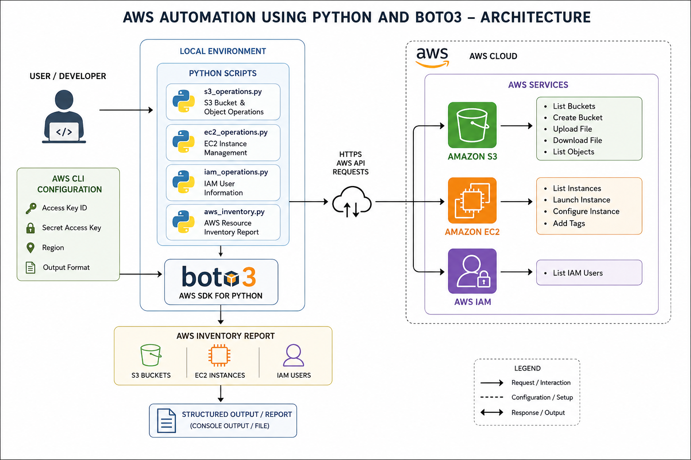

# AWS Automation Using Python and Boto3

> **AWS Internship — Center of Excellence, KIET**

---

## Table of Contents

* [Overview](#overview)
* [Objective](#objective)
* [Architecture](#architecture)
* [Workflow](#workflow)
* [AWS Services Used](#aws-services-used)
* [Implementation Summary](#implementation-summary)
* [Testing and Verification](#testing-and-verification)
* [Expected Result](#expected-result)
* [Security Considerations](#security-considerations)
* [Documentation](#documentation)
* [Project Information](#project-information)
* [Author](#author)

---

## Overview

This project demonstrates **AWS resource automation using Python and Boto3**.

The objective is to interact with and manage AWS resources programmatically instead of performing every operation manually through the AWS Management Console.

The project focuses on automating basic operations for:

* **Amazon S3**
* **Amazon EC2**
* **AWS IAM**

It also includes an **AWS Inventory Report** that retrieves information about selected resources available in the AWS account.

### High-Level Workflow

```text
Python Script
     │
     │ Boto3
     ▼
AWS SDK for Python
     │
     ├───────────────┐
     │               │
     ▼               ▼
Amazon S3       Amazon EC2
     │               │
     └───────┬───────┘
             │
             ▼
          AWS IAM
             │
             ▼
      Resource Information
             │
             ▼
      AWS Inventory Report
```

The project demonstrates the basic principle of **cloud automation**:

> **Write a script → Use Boto3 to communicate with AWS → Perform resource operations → Retrieve and report resource information**

---

## Objective

The main objectives of this project are to:

* Understand the fundamentals of AWS automation using Python.
* Configure AWS CLI for programmatic AWS access.
* Install and use the Boto3 AWS SDK for Python.
* Automate common Amazon S3 operations.
* Manage Amazon EC2 resources using Python.
* Retrieve IAM user information programmatically.
* Generate an AWS resource inventory report.
* Understand how Python scripts can interact with AWS services.

---

## Architecture

The project uses **Python and Boto3** as the primary automation layer.

### Architecture Components

1. **Python** — Provides the scripting and automation logic.
2. **Boto3** — AWS SDK used by Python to communicate with AWS services.
3. **Amazon S3** — Used for bucket and object operations.
4. **Amazon EC2** — Used for instance management.
5. **AWS IAM** — Used to retrieve IAM user information.
6. **AWS CLI Configuration** — Provides the AWS credentials and default region used by Boto3.

### Architecture Diagram



### Architecture Flow

```text
┌─────────────────────────┐
│      Python Scripts     │
│                         │
│  S3 | EC2 | IAM         │
│  Inventory              │
└────────────┬────────────┘
             │
             │ Boto3
             ▼
┌─────────────────────────┐
│     AWS SDK for Python  │
│         Boto3           │
└────────────┬────────────┘
             │
       ┌─────┼─────────┐
       │     │         │
       ▼     ▼         ▼
┌─────────┐ ┌─────────┐ ┌─────────┐
│Amazon S3│ │Amazon   │ │AWS IAM  │
│         │ │EC2      │ │         │
└────┬────┘ └────┬────┘ └────┬────┘
     │           │           │
     └───────────┼───────────┘
                 │
                 ▼
       ┌────────────────────┐
       │ AWS Inventory      │
       │ Report             │
       └────────────────────┘
```

---

## Workflow

The complete workflow is:

1. Python and Boto3 are installed on the system.
2. AWS CLI is configured using `aws configure`.
3. AWS credentials and the default AWS region are configured.
4. Python scripts use Boto3 to create AWS service clients or resources.
5. The S3 script performs bucket and object operations.
6. The EC2 script retrieves and manages EC2 instances.
7. The IAM script retrieves IAM user information.
8. The inventory script collects information from the AWS account.
9. The collected information is displayed as an **AWS Inventory Report**.

The basic interaction can be represented as:

```text
Python
   ↓
Boto3
   ↓
AWS API
   ↓
AWS Service
   ↓
Resource Information / Operation Result
```

---

## AWS Services Used

| AWS Service    | Purpose                                        |
| -------------- | ---------------------------------------------- |
| **Amazon S3**  | Bucket and object storage operations           |
| **Amazon EC2** | Virtual compute instance management            |
| **AWS IAM**    | Retrieval of IAM user information              |
| **AWS CLI**    | AWS configuration and command-line interaction |
| **Boto3**      | Python SDK used to interact with AWS services  |

---

## Implementation Summary

The implementation consists of the following major steps.

### 1. Install Required Tools

The project requires:

* Python 3.x
* AWS CLI
* Boto3
* An AWS account with appropriate permissions

Boto3 can be installed using:

```bash
pip install boto3
```

Verify Python:

```bash
python --version
```

Verify AWS CLI:

```bash
aws --version
```

---

### 2. Configure AWS CLI

AWS CLI is configured using:

```bash
aws configure
```

The following information is provided:

```text
AWS Access Key ID
AWS Secret Access Key
Default region name
Default output format
```

Example:

```text
Default region name: ap-south-1
Default output format: json
```

Boto3 can then use the configured AWS credentials to communicate with AWS.

---

### 3. Amazon S3 Automation

The S3 script demonstrates basic S3 operations using Boto3.

Operations include:

* List S3 buckets
* Create an S3 bucket
* Upload a file
* Download a file
* List objects inside a bucket

Example:

```python
import boto3

s3 = boto3.client("s3")

response = s3.list_buckets()

for bucket in response["Buckets"]:
    print(bucket["Name"])
```

The script demonstrates how Python can interact programmatically with Amazon S3.

---

### 4. Amazon EC2 Automation

The EC2 script demonstrates programmatic EC2 management using Boto3.

Operations include:

* List EC2 instances
* Launch an EC2 instance
* Configure the required launch parameters
* Configure AMI
* Configure instance type
* Configure key pair
* Configure security group
* Add instance tags

Example:

```python
import boto3

ec2 = boto3.resource("ec2")

instances = ec2.instances.all()

for instance in instances:
    print(instance.id, instance.state["Name"])
```

This demonstrates how EC2 resources can be accessed and managed using Python.

---

### 5. AWS IAM Automation

The IAM script retrieves IAM user information using Boto3.

Operation performed:

* List IAM users

Example:

```python
import boto3

iam = boto3.client("iam")

response = iam.list_users()

for user in response["Users"]:
    print(user["UserName"])
```

This demonstrates programmatic access to AWS identity information.

---

### 6. AWS Inventory Report

The inventory script collects information about selected AWS resources.

The report includes:

```text
AWS Inventory
│
├── S3 Buckets
├── IAM Users
└── EC2 Instances
```

The script uses Boto3 to retrieve resource information and presents it in a structured format.

This provides a basic foundation for building automated AWS resource reporting systems.

> For detailed commands and execution steps, see [Commands.md](./Commands/Commands.md).

---

## Testing and Verification

Each automation script is executed separately and its output is verified.

### S3 Verification

The S3 script is executed to verify:

```text
S3 Buckets
     ↓
Bucket Creation
     ↓
File Upload
     ↓
File Download
     ↓
Object Listing
```

The expected output contains the relevant bucket and object information.

---

### EC2 Verification

The EC2 script is executed to verify:

```text
EC2 Instances
      ↓
Instance ID
      ↓
Instance State
```

The output can be used to verify the EC2 instances available in the configured AWS region.

---

### IAM Verification

The IAM script retrieves the available IAM users:

```text
IAM
 ↓
List Users
 ↓
User Information
```

The expected output contains the IAM usernames returned by the AWS API.

---

### Inventory Verification

The inventory script combines resource information:

```text
S3 Buckets
     │
     ├──────────────┐
     │              │
IAM Users      EC2 Instances
     │              │
     └───────┬──────┘
             ▼
      AWS Inventory
          Report
```

Detailed testing and execution commands are available in:

[Commands.md](./commands.md)

---

## Expected Result

The project successfully demonstrates programmatic interaction with AWS services using Python and Boto3.

The final workflow is:

```text
Python Script
      ↓
    Boto3
      ↓
   AWS APIs
      ↓
┌─────┼──────────┐
│     │          │
▼     ▼          ▼
S3    EC2       IAM
│     │          │
└─────┼──────────┘
      ↓
AWS Inventory Report
```

The expected result is successful execution of the individual automation scripts and generation of an inventory containing information about:

* S3 buckets
* EC2 instances
* IAM users

This demonstrates the fundamentals of **AWS cloud automation using Python**.

---

## Security Considerations

* Never commit AWS credentials to GitHub.
* Do not hard-code access keys or secret keys inside Python scripts.
* Use IAM identities with only the permissions required for the project.
* Avoid granting unnecessary administrative permissions.
* Remove temporary AWS resources after completing the experiment.
* Avoid exposing AWS account information in screenshots or documentation.
* Do not include sensitive credentials in `README.md`, source files, or command files.

Example of information that should **not** be committed:

```text
AWS Access Key ID
AWS Secret Access Key
AWS Session Token
```

---

## Documentation

Detailed project resources are available below:

| Resource                                                                     | Description                                                               |
| ---------------------------------------------------------------------------- | ------------------------------------------------------------------------- |
| [Theory](./Theory/)                                                          | Detailed theory and concepts related to AWS automation, Python, and Boto3 |
| [Commands.md](./Commands/Commands.md)                                                 | Setup, execution, and AWS CLI command references                          |
| [Architecture Diagram](./Architecture/aws-automation-boto3-architecture.png) | Project architecture diagram                                              |
| [Scripts](./Theory/All%20Notepad%20files.docx)                                                        | Python scripts used for AWS automation                                    |
| [Screenshots](./Theory/MyWork_%20CLI%20screenshots.docx)                                                | Execution and verification screenshots                                    |

---

## Project Information

| **Field**                | **Details**                                 |
| ------------------------ | ------------------------------------------- |
| **Project**              | AWS Automation Using Python and Boto3       |
| **Platform**             | AWS                                         |
| **Programming Language** | Python                                      |
| **SDK**                  | Boto3                                       |
| **Services**             | S3, EC2, IAM                                |
| **Configuration**        | AWS CLI                                     |
| **Automation Focus**     | AWS Resource Management                     |
| **Reporting**            | AWS Inventory Report                        |
| **Internship**           | AWS Internship — Center of Excellence, KIET |

---

## Author

**Aditi Narang**

---